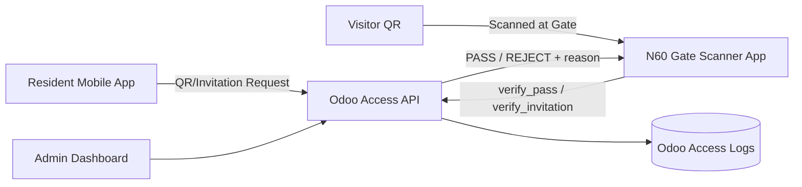

# compound-mobile-access-pass

Planning-only repository for a compound mobile access system using Odoo backend services, resident mobile passes, and N60 Android gate scanners.

## Project Overview
This project defines the product and technical plan for replacing physical gate access with secure digital passes. Residents use a mobile app QR pass, while security guards validate entry at gates using N60 scanner devices connected to Odoo.

## Main Business Idea
Deliver a controlled, auditable, and user-friendly gate access platform that:
- Reduces manual gate checks and paper visitor logs
- Improves resident and visitor entry speed
- Gives compound management full visibility over access events
- Centralizes rules and logs in Odoo

## MVP Scope
- Resident authentication and unit mapping
- Dynamic resident QR pass (Phase 1)
- Visitor and delivery invitations with expiring QR
- N60 gate scanner app with PASS/REJECT decision display
- Gate/device authorization and real-time backend verification
- Entry/exit access logs and audit trail
- Admin controls for blocking resident, unit, or device

### Out of MVP (Future)
- NFC HCE pass mode (planned for Phase 5)
- Offline gate queue and sync mode (planned for Phase 6)

## Main Actors
- Resident/Owner
- Visitor
- Delivery courier
- Maintenance worker
- Security guard
- Compound admin
- Security manager/auditor

## High-Level Architecture

## Documentation Index
- `docs/FULL_PLAN.md`
- `docs/USE_CASES.md`
- `docs/API_SPEC.md`
- `docs/ODOO_MODELS.md`
- `docs/ANDROID_APP_PLAN.md`
- `docs/N60_GATE_DEVICE_PLAN.md`
- `docs/SECURITY_RULES.md`
- `docs/IMPLEMENTATION_PHASES.md`
- `docs/DEMO_FLOW.md`

## Final Summary
This repository is a practical MVP-first planning baseline for delivering secure compound access using Odoo, Android resident apps, and N60 gate scanners with QR in early phases and NFC in future scope.
