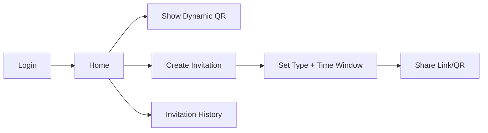

# ANDROID APP PLAN — Resident Mobile App

## Objective
Deliver a resident-facing mobile app that provides secure digital access and invitation management with minimal friction.

## MVP Features
1. **Login**
   - Secure login tied to resident account.
2. **Resident Profile**
   - View resident details and account status.
3. **Unit Selection**
   - Select active unit when multiple units are linked.
4. **Dynamic QR Pass**
   - Time-bound QR payload refreshed regularly.
5. **Invitation Creation**
   - Visitor, delivery, and maintenance invitation types.
6. **Invitation Sharing**
   - Share via WhatsApp, SMS, or secure link.
7. **Invitation History**
   - Track pending/used/expired invitations.
8. **Push Notifications**
   - Alerts for invitation usage or expiry.

## Non-Functional Requirements
- Quick pass display under 2 seconds
- Tamper-resistant token handling
- Graceful error handling for network failures

## Future Scope
- **NFC HCE Support (Phase 5):** Use phone as NFC credential at compatible readers.
- **Offline resident mode:** Future only; not in MVP.

## UX Flow

## Final Summary
The resident app MVP focuses on fast QR access and invitation workflows, while NFC HCE and offline behaviors remain planned future enhancements.
