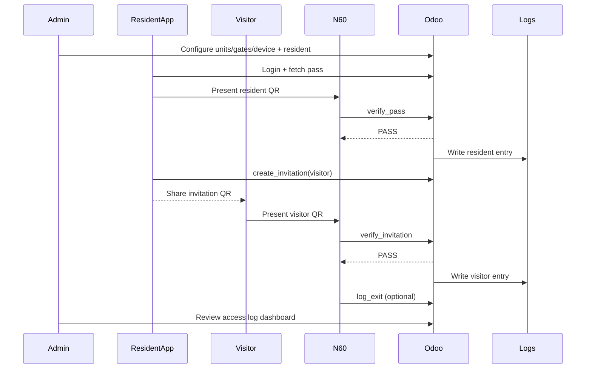

# DEMO FLOW — End-to-End Script

## Demo Objective
Show the full lifecycle from setup to resident and visitor access validation with audit visibility.

## Script Steps
1. **Admin creates compound, units, gates, and N60 device**
   - Create gate `GATE-A` and assign `DEV-001`.
2. **Admin creates resident**
   - Assign resident to unit `B1-203`.
3. **Resident logs into mobile app**
   - Resident account session established.
4. **Resident shows QR pass**
   - Dynamic pass visible on app screen.
5. **N60 scans QR at gate**
   - Security guard scans resident QR.
6. **Odoo returns PASS**
   - N60 displays PASS + success feedback.
7. **Resident creates visitor invitation**
   - Type=visitor, single-use, valid for same day.
8. **Visitor receives QR**
   - Invitation shared via link/QR.
9. **Security scans visitor QR**
   - N60 submits invitation for verification.
10. **Odoo validates and logs entry**
    - PASS with `decision_id` and log record saved.
11. **Optional exit scan**
    - Exit event recorded via `log_exit`.
12. **Admin reviews access logs**
    - Filter by gate, resident, invitation, and reason code.

## Demo Sequence Diagram

## Demo Checklist
| Item | Expected Result |
|---|---|
| Resident scan | PASS in under 5 sec |
| Visitor scan | PASS once, reuse rejected |
| Failed token test | REJECT with reason |
| Log review | All events visible with decision IDs |

## Final Summary
This demo validates core value: admins configure policy, residents and visitors pass through controlled QR verification at N60 gates, and Odoo preserves complete access traceability.
