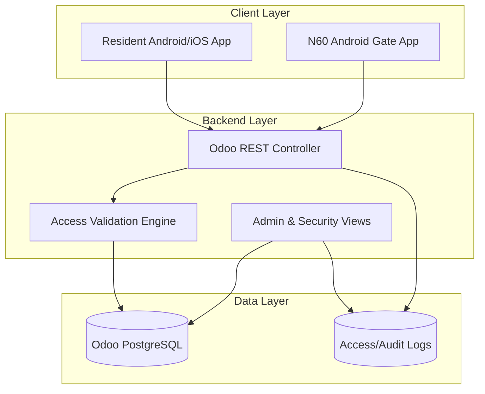

# FULL PLAN — Compound Mobile Access Pass

## Complete Product Vision
Build a secure access platform where resident identity, gate permissions, invitations, and audit logs are centrally managed in Odoo and executed operationally at compound gates through N60 scanner devices.

## Business Objectives
1. Reduce unauthorized entry risk.
2. Cut gate processing time for residents and visitors.
3. Digitize visitor and delivery invitation lifecycle.
4. Provide complete traceability for every gate decision.
5. Enable compound operators to enforce configurable security rules.

## Target Users
| User | Needs | Success Metric |
|---|---|---|
| Resident/Owner | Fast entry and easy invitation sharing | Entry time under 5 seconds |
| Security Guard | Clear PASS/REJECT decision and reason | Low decision ambiguity |
| Compound Admin | Rules, blocks, and audit visibility | Full policy control |
| Security Auditor | Reliable event history | 100% log completeness |

## Core Modules
1. Identity and unit mapping
2. Pass and invitation engine
3. Gate device management
4. Security policy evaluation
5. Access logging and reporting

## Mobile Resident App
- Login and resident profile
- Unit selection when user has multiple units
- Dynamic resident QR pass
- Visitor, delivery, and maintenance invitation creation
- Invitation sharing by WhatsApp/SMS/deep link
- Invitation history and status
- Push notifications for invitation use/expiry
- Future: NFC HCE pass mode

## N60 Gate Scanner App
- Device authentication with API key
- QR scan for resident and invitation passes
- Server verification call to Odoo
- Full-screen PASS/REJECT + reason
- Beep/vibration feedback
- Optional event photo capture
- Device heartbeat and health status
- Future: offline queue + NFC read

## Odoo Backend
- REST API for pass/invitation verification and device config
- Resident/unit/gate/device domain models
- Security rules engine (gate/time/device/resident checks)
- Access logs and audit trail
- Admin controls for activation/blocking

## Admin/Security Dashboard
- Gate activity timeline
- Failed access attempts monitoring
- Resident/unit/device block controls
- Invitation lifecycle view
- Device heartbeat and connectivity view

## Technical Architecture

## Implementation Roadmap
- Phase 0: Planning repository and specs
- Phase 1: Odoo backend MVP with QR validation APIs
- Phase 2: N60 scanner app for gate operations
- Phase 3: Resident app with QR and invitations
- Phase 4: Visitor/delivery enhancements and controls
- Phase 5: NFC HCE research and implementation
- Phase 6: Offline mode and advanced security
- Phase 7: Dashboards and reporting enhancements

## Final Summary
The plan delivers an MVP-first secure access ecosystem centered on Odoo validation and N60 gate enforcement, with QR-first deployment and NFC/offline capabilities intentionally staged for later phases.
