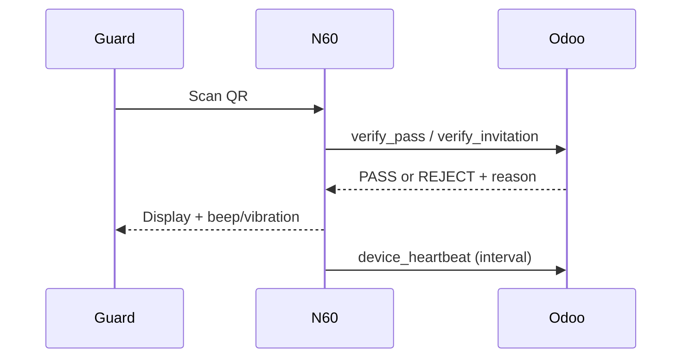

# N60 GATE DEVICE PLAN — Scanner App

## Objective
Define an N60 Android app for gate security guards to scan credentials and enforce backend PASS/REJECT decisions.

## Core Features
1. **Gate Device Login/API Key**
   - Device authenticates to Odoo with provisioned credentials.
2. **QR Scan Mode (MVP)**
   - Camera scanning for resident and invitation QR payloads.
3. **NFC Scan Mode (Future)**
   - Planned for NFC HCE phase.
4. **Send Scan to Odoo**
   - Real-time verification requests.
5. **Show PASS / REJECT**
   - Large visual response plus reason code.
6. **Beep/Vibration Feedback**
   - Distinct patterns for pass and reject.
7. **Optional Photo Capture**
   - Controlled by device config policy.
8. **Offline Queue (Future)**
   - Queue scans for later sync when connectivity returns.
9. **Device Heartbeat**
   - Periodic health and version telemetry.

## Operational Sequence

## MVP Constraints
- Always-online verification model
- QR only in first release
- Device authorization mandatory before any scan

## Future Scope
- NFC scanning
- Offline queue + conflict handling on sync

## Final Summary
The N60 app is the enforcement edge for gate access, providing immediate PASS/REJECT outcomes from Odoo and secure, auditable scanner behavior.
