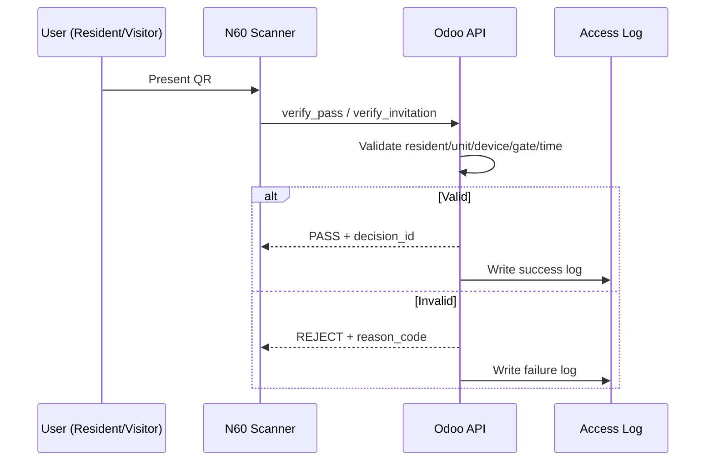

# USE CASES — Compound Mobile Access

## Actors
- Resident
- Visitor
- Delivery courier
- Maintenance worker
- Security guard
- Admin
- Odoo backend

## 1) Resident Gate Entry
**Preconditions:** Resident active, unit active, pass valid, gate authorized, N60 device authorized.

**Main Flow:**
1. Resident opens app and presents dynamic QR.
2. Security guard scans QR using N60.
3. N60 sends verification request to Odoo.
4. Odoo validates all security rules.
5. Odoo returns PASS.
6. Gate opens and access log is recorded.

**Alternative:** If any rule fails, response is REJECT with reason code and failed attempt log.

## 2) Visitor Invitation
1. Resident creates visitor invitation with validity window and optional gate scope.
2. System generates single-use invitation QR/token.
3. Resident shares invitation link/QR.
4. Visitor presents QR at gate.
5. Guard scans; Odoo verifies invitation validity and usage state.
6. If valid, PASS and mark invitation as used.

## 3) Delivery Invitation
1. Resident creates delivery invitation with shorter validity and delivery category.
2. Delivery receives QR.
3. Gate scan verifies invitation and policy (time/gate/use limits).
4. PASS if valid; otherwise REJECT.

## 4) Maintenance Worker Invitation
1. Resident or admin creates maintenance pass with extended but bounded time window.
2. Worker presents pass at gate.
3. Odoo verifies worker invitation against scope and validity.
4. PASS/REJECT result shown on N60 and logged.

## 5) Security Guard Scan Flow
1. Guard logs into authorized N60 device.
2. Device pulls latest config from Odoo.
3. Guard scans QR.
4. Device sends payload to verify endpoint.
5. Device displays PASS/REJECT with visual and audio feedback.
6. Device records transaction reference for audit.

## 6) Admin Blocking Resident/Unit/Device
1. Admin flags resident, unit, or device as blocked.
2. Rule engine applies block immediately.
3. Any subsequent scan involving blocked entity returns REJECT.
4. Action and related attempts are logged for audit.

## 7) Entry and Exit Tracking
1. Entry scan logs event type = ENTRY.
2. Optional exit scan logs event type = EXIT.
3. Admin dashboard can view complete movement history by resident/invitation/gate.

## 8) Failed Access Attempt
1. Scan request reaches Odoo but fails one or more validations.
2. Odoo returns REJECT with reason (expired token, blocked unit, unauthorized gate, etc.).
3. Failure is written to access log with metadata.
4. Repeated failures can trigger alerts in future phases.

## Sequence Overview

## Final Summary
These use cases define the operational behaviors for residents, invited parties, guards, and admins, with strict backend validation and full auditability for every PASS/REJECT decision.
